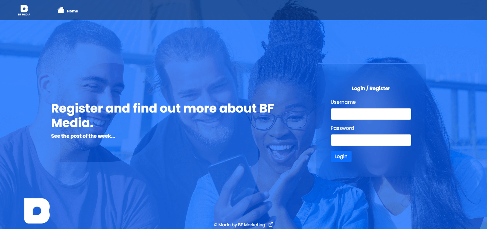
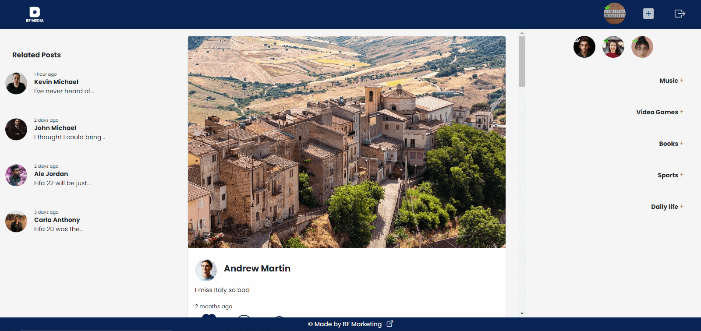
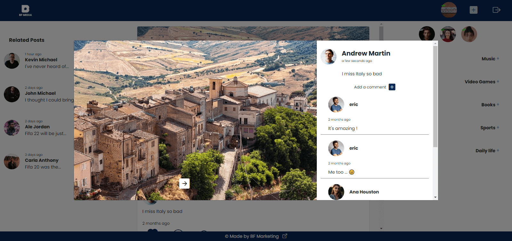
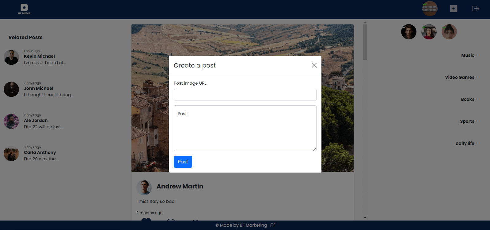

# BF Media - Social Media Client Side

This project was made for the Company's (BF Marketing) portfolio.
The goal was to make an exemplar of a social media site with the basic features where users can post, like post, comment, e get views.
It was built with MERN Stack (MongoDB, Express JS, React JS and Node JS).

This repository shows how the client-side was made. You can see the photos below or go directly to the site here: [https://bfmedia.netlify.app/](https://bfmedia.netlify.app/).

## Server side

To see how the server-side was built, you should go to the backend repository: [https://github.com/BF-Marketing/BF-Media-Social-Network-Server](https://github.com/BF-Marketing/BF-Media-Social-Network-Server)

### Homepage

### User page

### Post details

### Create post

